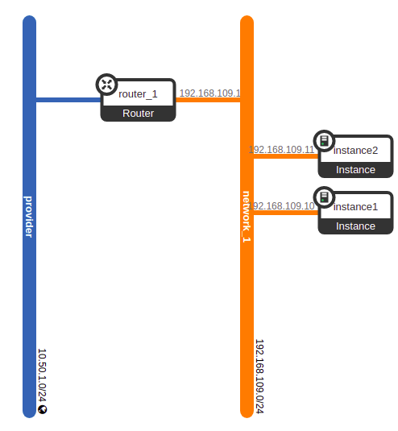

# jarvis-terraform
Jarvis com terraform

# Requisitos
- instalar o `terraform`
- baixar o `cloud.yaml` do seu `openstack`
- baixar o `root.crt` 

# Executação

```bash
# baixar as dependencias
terraform init
```


```bash
# aplicar a infraestrutura
terraform apply
```

```bash
# destruir a infraestrutura
terraform destroy
```

# Resultado
